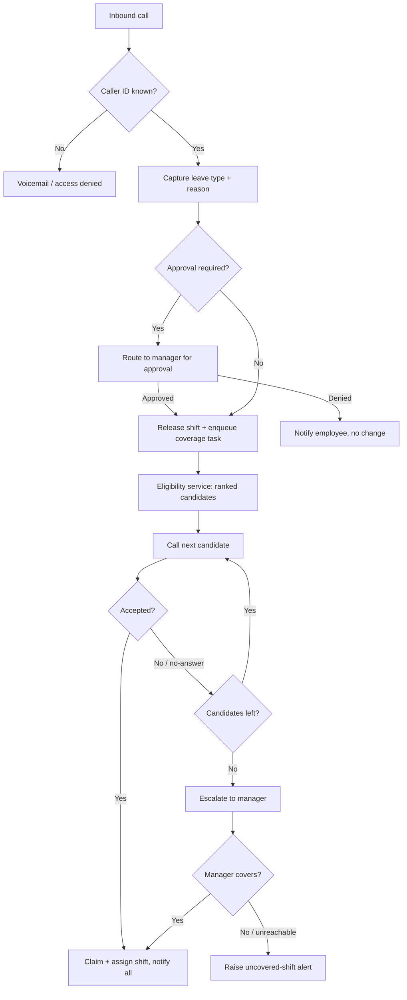

# Product Requirements Document — Teem.Talk

**Status:** Draft v0.1 (MVP scope) · **Last updated:** June 19, 2026 · **Owner:** _TBD_

---

## 1. Summary

Teem.Talk is a voice-first agent that automates shift leave requests and last-minute coverage for small, shift-based teams — cafés, restaurants, security details, and similar small businesses. When a scheduled employee needs time off, they call the agent. It captures the request, updates the schedule, and then autonomously calls eligible teammates one at a time until the shift is covered, escalating to the manager only if no one is available. The goal is to take the manual burden of leave handling and shift backfilling off owners and managers entirely for routine cases.

---

## 2. Problem

Small shift-based businesses run lean, and when an employee calls out, backfilling the shift falls on a single owner or manager — usually by phone or text, often at inconvenient hours. The process is reactive, error-prone, and time-consuming: chasing replacements one by one, negotiating who can cover, and manually patching the schedule. Existing scheduling tools store the schedule and may notify staff of changes, but they don't _do the calling and negotiating_ needed to actually fill a gap. Teem.Talk closes that gap by handling the conversation and the coordination, not just the data.

---

## 3. Goals & Non-Goals

### Goals (MVP)

- Let an employee request leave entirely by phone, with no manager involvement for routine cases.
- Automatically identify eligible coverage and secure a replacement via outbound calls.
- Keep the schedule a single source of truth and guarantee no silently-uncovered shift.
- Escalate to a manager only when automation cannot resolve coverage.
- Maintain an auditable record of every request, call, and schedule change.

### Non-Goals (MVP — tracked in Roadmap)

- Urgency / time-aware routing (last-minute vs. advance handling).
- Parallel / simultaneous outbound calling.
- SMS or app-based channels (voice-first only for MVP).
- Partial / split-shift coverage and incentive offers.
- Scheduling connectors beyond Square.
- Automated labor-law / predictive-scheduling compliance.

---

## 4. Target Users

| Persona             | Role in system                        | Primary need                                                       |
| ------------------- | ------------------------------------- | ------------------------------------------------------------------ |
| Owner / Manager     | Beneficiary; escalation target; admin | Stop manually handling call-outs and backfilling shifts            |
| Requesting employee | Inbound caller                        | Quickly and reliably get a shift covered when they can't work      |
| Covering employee   | Outbound call recipient               | Be offered relevant open shifts and accept/decline easily by voice |

**Target businesses:** small teams (~3–20 staff) with fixed daily shifts and a single location — cafés, restaurants, retail, and security details — where one manager typically owns scheduling.

---

## 5. Success Metrics

- **Auto-coverage rate** _(primary)_ — % of leave requests resolved without any manager involvement.
- **Manager-touch reduction** — decrease in manager actions per call-out vs. current baseline.
- **Time-to-fill** — elapsed time from leave request to confirmed coverage.
- **Zero silent gaps** — every unresolved shift surfaces an explicit alert (target: 100%).
- **Call comprehension / success rate** — % of voice interactions completed without human fallback.
- **Schedule accuracy** — divergence between system state and Square after each change (target: 0).

---

## 6. User Stories (core)

- As a scheduled employee, I can call a number, have it confirm it's me, and tell the agent I need a shift off — so my shift is released and someone else is found.
- As an available teammate, I get a call offering a specific open shift, and I can accept or decline by voice.
- As a manager, I'm only called when no teammate can cover, and I can review every change after the fact.
- As a manager, I can override or reassign any shift manually at any time.

---

## 7. Core Workflow

**Plain-language flow:**

1. **Inbound (Intake agent).** The caller's phone number is matched to a known employee. Unknown numbers are sent to voicemail and granted no scheduling actions.
2. The agent confirms the caller's upcoming shift, captures the **leave type**, and records the reason (kept private).
3. If the leave type **requires approval**, the request is routed to the manager for approval _before_ any coverage begins. Otherwise (notification-type leave such as sick/emergency), the shift is released immediately.
4. The released shift is written to the schedule, and a **coverage task** is enqueued (asynchronous handoff — the caller is not held on the line during the call-down).
5. **Dispatch (Coverage agent)** pulls the task, asks the eligibility service for a ranked list of eligible teammates, and calls them **one at a time**.
6. On the first "yes," the shift is **claimed** (transactional lock) and assigned; remaining candidates are skipped. Declines, no-answers, and voicemails advance to the next candidate after a timeout.
7. If the candidate list is exhausted, the agent **escalates to the manager**. If the manager is unreachable, the system raises an explicit **uncovered-shift alert** rather than failing silently.
8. All affected parties receive a **confirmation** (requester, new cover, manager), and the schedule reflects the final state.



---

## 8. Functional Requirements

### 8.1 Identity & Access

- **FR-1** Match the inbound caller's phone number against the employee roster; only known, active employees proceed.
- **FR-2** Unknown or unmatched numbers are routed to voicemail and denied all scheduling actions.
- **FR-3** Provide a manual-override hook for future handling of shared/changed numbers (not auto-enabled in MVP).

### 8.2 Leave Intake

- **FR-4** Capture the leave type (e.g. sick, emergency, personal, planned/vacation).
- **FR-5** Record a free-form reason, stored privately and never disclosed to other staff.
- **FR-6** Branch on leave type: approval-required types pause for manager approval; notification types release the shift immediately.
- **FR-7** Confirm the specific shift being vacated before making any change.

### 8.3 Eligibility Engine (server-side)

Eligibility is computed by a backend service — an edge function exposed to the voice agent as a single tool — not in the prompt. This keeps the prompt thin and the rules testable.

- **FR-8** A candidate is eligible only if not already scheduled at that time (no double-booking).
- **FR-9** The candidate must hold the role/certification the shift requires.
- **FR-10** The candidate must not be on their own approved leave.
- **FR-11** MVP includes basic hours awareness (don't exceed a configured max); advanced rest-gap ("clopening") rules and overtime-cost optimization are configurable extensions (post-MVP).
- **FR-12** The engine returns a **ranked** candidate list per a configurable policy (default order TBD — see Open Questions).

### 8.4 Coverage Dispatch

- **FR-13** Process candidates **sequentially** — one call at a time — in MVP.
- **FR-14** Interpret outcomes: accept, decline, no-answer/voicemail, unintelligible.
- **FR-15** Advance to the next candidate on decline/no-answer after a configurable timeout; configurable retry policy for no-answers.
- **FR-16** On accept, **atomically claim** the shift (transactional update with a uniqueness constraint) so it can never be double-assigned, then assign and stop.

### 8.5 Escalation

- **FR-17** If no candidate accepts, call the manager (escalation contact) and offer the shift/decision.
- **FR-18** If the manager is unreachable, raise a persistent **uncovered-shift alert** visible to the manager; never mark the task resolved.

### 8.6 Notifications & Confirmation

- **FR-19** On resolution, notify the requesting employee (confirmed off), the covering employee (shift details), and the manager (change summary).
- **FR-20** Confirmations in MVP are voice/voicemail; SMS is a planned channel (Roadmap).

### 8.7 Scheduling Data & Source of Truth

- **FR-21** The schedule of record is **Square (Labor API)**; the system reads and writes shifts there.
- **FR-22** A thin internal store holds workflow state the scheduling tool doesn't model: coverage tasks, call attempts/outcomes, escalation status, leave reasons, and the audit trail.
- **FR-23** Reconcile with Square via webhooks so external/manual edits are reflected.

### 8.8 Manager Controls

- **FR-24** The manager can view all schedule changes and the full activity log.
- **FR-25** The manager can manually override or reassign any shift at any time.

---

## 9. Non-Functional Requirements

- **Latency** — voice turns must feel responsive; eligibility tool calls must return fast enough to avoid dead air (target < ~1–2s).
- **Reliability & idempotency** — a dropped call mid-update must not corrupt state; all schedule writes are idempotent and recoverable.
- **Concurrency** — shift assignment is the critical section; a single winner is guaranteed via the transactional claim/constraint.
- **Security** — protect API tokens (Vapi, Square) and PII; least-privilege scopes; no secrets in prompts.
- **Privacy** — leave reasons (which may include medical context) are access-restricted and never broadcast to staff.
- **Observability** — structured logs for every call, decision, and schedule mutation, surfaced for diagnostics and audit.
- **Rate limits** — handle Square API limits and Vapi constraints gracefully (backoff/retry).
- **Compliance posture** — MVP does not automate labor-law compliance; deferred items (predictive scheduling, minor-hour limits, call-recording consent) are tracked as Roadmap risks.
- **Cost** — voice minutes (Vapi) and any Square plan cost scale with usage; the Square sandbox is free for build and validation.

---

## 10. System Architecture

Four logical roles, coordinated by an orchestrator that owns workflow state:

- **Intake agent (inbound, Vapi)** — identity, leave capture, approval branch.
- **Orchestrator / state layer (InsForge)** — owns coverage tasks, ranking inputs, locking, and escalation decisions; hands off to dispatch asynchronously via a task queue.
- **Coverage agent (outbound, Vapi)** — runs the sequential call-down and accept/decline handling.
- **Escalation + Notifier** — manager calls and confirmations to all parties.

Eligibility and leave-routing live as **edge functions** on the backend, exposed to the Vapi agents as tools. The schedule is read/written through the **Square Labor API**; the internal store holds workflow/audit state and syncs via Square webhooks.

```
Employee ──call──▶ Vapi (Intake) ──tools──▶ InsForge (state + eligibility) ◀──sync──▶ Square (schedule of record)
                                     │
                                     └── enqueue ──▶ Coverage task ──▶ Vapi (Dispatch) ──calls──▶ Teammates → Manager
```

---

## 11. Data Model (key entities)

| Entity           | Key fields                                                                            |
| ---------------- | ------------------------------------------------------------------------------------- |
| **Employee**     | id, name, phone, role, certifications, status, max_hours, is_manager                  |
| **Shift**        | id, location, role_required, start, end, assigned_employee_id, status                 |
| **LeaveRequest** | id, employee_id, shift_id, type, reason _(private)_, approval_status, created_at      |
| **CoverageTask** | id, shift_id, status, candidate_queue, current_candidate, attempts, escalation_status |
| **CallAttempt**  | id, task_id, employee_id, channel, outcome, timestamp                                 |
| **AuditEvent**   | id, actor, action, entity, before/after, timestamp                                    |

Employee and Shift data may be sourced from Square; LeaveRequest, CoverageTask, CallAttempt, and AuditEvent are internal.

---

## 12. Integrations

- **Vapi** — inbound + outbound voice. Agent tools call backend HTTP endpoints (eligibility, claim, schedule update). A transfer-to-human path is reserved.
- **Square Labor API (Sandbox for MVP)** — scheduled shifts via the create → update → publish flow, plus webhooks for shift/time-off events. The sandbox is free for build and validation; production requires the seller's qualifying Square plan.
- **InsForge** — Postgres data store, edge functions for eligibility and leave-routing, realtime for the manager view; serves as the workflow/audit layer behind the agents.

---

## 13. Edge Cases & Failure Handling

- **Requester is the only eligible candidate** → no self-coverage; escalate to manager.
- **Manager is the one requesting leave, or manager unreachable** → fall back to a secondary escalation contact (config) or raise the uncovered-shift alert.
- **Multiple/overlapping leave requests for the same shift** → handled serially; each gets its own coverage task; locking prevents conflicting assignment.
- **Minimum staffing** → the goal is "maintain required coverage and non-negotiable roles (e.g. a keyholder)," not merely fill a named slot. Basic version in MVP; richer staffing rules post-MVP.
- **No-answer / voicemail / dropped call** → timeout, advance to next, configurable retry.
- **Caller not understood (noise, accent, language)** → graceful fallback / transfer-to-human (reserved).
- **External or manual schedule edit mid-process** → webhook reconciliation; re-validate before assigning.

---

## 14. Roadmap (post-MVP)

| Phase    | Adds                                                                                                                   |
| -------- | ---------------------------------------------------------------------------------------------------------------------- |
| **V1.1** | SMS channel — reply-to-accept, confirmations, fallback for no-answers                                                  |
| **V1.2** | Time / urgency awareness — last-minute vs. advance routing, quiet hours, hard escalation cutoff                        |
| **V1.3** | Parallel outbound with safe claim; partial / split-shift coverage; incentive offers                                    |
| **V1.4** | Advanced eligibility (rest gaps, overtime optimization); richer minimum-staffing rules                                 |
| **V2**   | Additional scheduling connectors (7shifts, Deputy, When I Work); multi-location / time zones                           |
| **V2+**  | Compliance automation (predictive scheduling, minor-hour limits, recording consent); "yes-then-no-show" accountability |

---

## 15. Open Questions & Risks

- **Candidate ranking policy** — seniority, fairness/round-robin, volunteer-first, or lowest-overtime? Needs a decision; directly affects perceived fairness among staff.
- **Approval-required leave types** — the exact list, and the approval SLA before coverage proceeds.
- **Square production plan** — confirm which Square plan exposes scheduling for real sellers, and the cost implication for customers.
- **Voicemail semantics** — does reaching voicemail count as a decline immediately, or after a callback window?
- **Identity edge** — the policy for shared/changed numbers before the manual-override hook exists.
- **Risk — single-integration dependence.** Tying the MVP to Square limits which businesses can adopt until connectors expand.
- **Risk — voice comprehension failures** could strand a request. The transfer-to-human path should ship early, even if minimal.

---

## 16. Glossary

- **Intake agent** — the inbound voice agent that takes leave requests.
- **Coverage / dispatch agent** — the outbound voice agent that calls teammates.
- **Coverage task** — the unit of work to fill one vacated shift.
- **Claim / lock** — the transactional guarantee that one shift is assigned to exactly one person.
- **Uncovered-shift alert** — an explicit signal that automation could not fill a shift.
