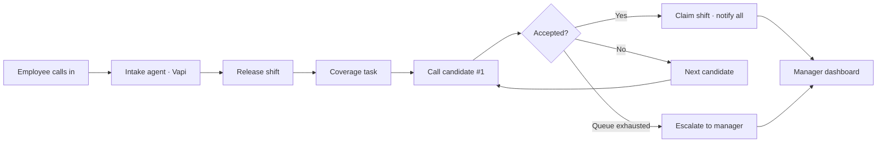

# TeemTalk — Voice-First Shift Coverage for Small Teams

**Hackathon submission · June 2026**

When a barista calls out sick, someone has to find a replacement — usually the manager, usually by phone, usually at the worst time. **TeemTalk** is a voice-first agent that handles that entire workflow: intake the leave request, release the shift, call eligible teammates one at a time until someone accepts, update the schedule, and notify everyone. The manager only gets involved when automation can't close the gap.

---

## What to look at first

| Artifact | Location | What it shows |
|---|---|---|
| **Product requirements** | [`PRD.md`](PRD.md) | Full MVP scope, architecture, integrations, and validated tech decisions |
| **Voice webhook + coverage logic** | [`functions/vapi-webhook.ts`](functions/vapi-webhook.ts) | InsForge edge function — Vapi tool calls, leave intake, outbound dispatch |
| **Database schema** | [`migrations/`](migrations/) | Postgres migrations — roster, shifts, coverage tasks, call attempts |
| **Demo seed data** | [`demo/seed-data.md`](demo/seed-data.md) | Fictional café roster and schedule for testing the leave → coverage loop |
| **Manager dashboard (UI)** | [`feature/manager-dashboard`](https://github.com/HaseebKhanYT/multi-modal-hack/tree/feature/manager-dashboard) branch | React dashboard — live call-down theater, schedule, activity, team roster |

---

## The problem

Small shift-based businesses (cafés, restaurants, retail, security) run lean. When someone calls out, the owner or manager personally phones replacements one by one — reactive, error-prone, and time-consuming. Scheduling tools store the roster but don't **do the calling and negotiating**. TeemTalk closes that gap.

---

## How it works



### System roles

| Role | Responsibility |
|---|---|
| **Intake agent** (inbound voice, Vapi) | Match caller ID, capture leave type + private reason, release shift |
| **Orchestrator** (InsForge Postgres + edge functions) | Own coverage tasks, ranking, transactional claim, escalation |
| **Coverage agent** (outbound voice, Vapi) | Sequential call-down — one teammate at a time until covered |
| **Notifier** | Confirmations to requester, cover, and manager |
| **Manager dashboard** (React) | Watch coverage live, approve leave, review audit trail |

---

## Tech stack

| Layer | Choice | Status |
|---|---|---|
| Voice (STT/TTS + telephony) | [Vapi](https://vapi.ai) | Validated — tool-call contract works end-to-end |
| LLM brain | [Nebius AI Studio](https://studio.nebius.ai) via Vapi `custom-llm` | Validated — Llama 3.3 70B emits reliable tool calls |
| Backend / state | [InsForge](https://insforge.dev) — Postgres, edge functions, realtime | **In progress** — migrations + webhook on `main` |
| Edge routing | [`functions/vapi-webhook.ts`](functions/vapi-webhook.ts) | **Built** — leave intake + outbound dispatch |
| Schedule of record | `ScheduleProvider` abstraction — Local (MVP) → Square Labor API | Local MVP; Square sandbox validated |
| Manager dashboard | Vite + React + TypeScript | **Built** — on `feature/manager-dashboard` branch |
| Language | TypeScript end-to-end | — |

---

## Repository layout (`main`)

```
multi-modal-hack/
├── README.md                 ← you are here (judge guide)
├── PRD.md                      Product requirements (v0.3)
├── AGENTS.md                   InsForge dev notes
├── CLAUDE.md                   Agent context
├── demo/
│   └── seed-data.md            Demo roster & schedule (Bean Scene café)
├── functions/
│   └── vapi-webhook.ts         Vapi webhook — intake + coverage dispatch
└── migrations/                 Postgres schema (roster, shifts, coverage, calls)
```

**Manager dashboard UI** lives on the [`feature/manager-dashboard`](https://github.com/HaseebKhanYT/multi-modal-hack/tree/feature/manager-dashboard) branch (`frontend/`).

---

## Quick demo — Manager Dashboard

Switch to the **`feature/manager-dashboard`** branch, then:

```bash
git checkout feature/manager-dashboard
cd frontend
npm install
npm run dev
```

Open **http://localhost:5173** and click through five views:

1. **Today** — daily stats, live coverage hero, floor timeline, pending approvals
2. **Coverage** — live call-down theater with transcript and candidate queue
3. **Schedule** — week-at-a-glance grid
4. **Activity** — full audit trail
5. **Team** — roster with keyholder badges and status pills

### Demo scenario (auto-plays on load)

> Marcus Lee (barista, 2–6 PM Saturday) calls out sick → Coverage agent rings teammates in ranked order → Sam declines → Elena no answer → **Tom Becker accepts** → schedule updates, stats flip green, activity log prepends sync events.

Use **Pause / Replay** on the Coverage view to re-run the call-down.

---

## What's built vs. planned

| Component | Status |
|---|---|
| Product requirements & architecture | Done — [`PRD.md`](PRD.md) |
| Postgres schema + migrations | Done — [`migrations/`](migrations/) |
| Vapi webhook (intake + dispatch) | Done — [`functions/vapi-webhook.ts`](functions/vapi-webhook.ts) |
| Demo seed data | Done — [`demo/seed-data.md`](demo/seed-data.md) |
| Manager dashboard UI (5 views) | Done — `feature/manager-dashboard` branch |
| Vapi + Nebius voice integration | Validated (see PRD §12) |
| InsForge realtime → dashboard | Planned |
| Square schedule sync | Validated API flow; provider swap pending |

---

## Success metrics (MVP)

- **Auto-coverage rate** — % of leave requests resolved without manager involvement
- **Manager-touch reduction** — fewer manual actions per call-out
- **Time-to-fill** — leave request → confirmed coverage
- **Zero silent gaps** — every unresolved shift surfaces an explicit alert
- **Schedule accuracy** — zero divergence from schedule of record after each change

---

## Target users

- **Owner / Manager** — watches coverage, approves leave, reviews audit trail; only called when automation fails
- **Requesting employee** — calls a number, says they need a shift off, hangs up
- **Covering employee** — gets an outbound call offering a specific open shift; accepts or declines by voice

**Target businesses:** small teams (~3–20 staff), single location, fixed daily shifts — cafés, restaurants, retail, security.

---

## Further reading

- [`PRD.md`](PRD.md) — functional requirements, data model, edge cases, roadmap
- [`demo/seed-data.md`](demo/seed-data.md) — demo roster, shifts, and test scenarios
- [`AGENTS.md`](AGENTS.md) — InsForge backend patterns for contributors

---

## Team

_TeemTalk — multi-modal hackathon submission._

---

<p align="center">
  <strong>TeemTalk</strong> · Voice in. Coverage out. Manager untouched.
</p>
