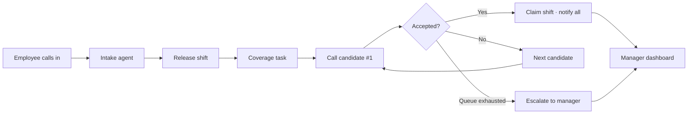

# TeemTalk — Voice-First Shift Coverage for Small Teams

**Hackathon submission · June 2026**

When a barista calls out sick, someone has to find a replacement — usually the manager, usually by phone, usually at the worst time. **TeemTalk** is a voice-first agent that handles that entire workflow: intake the leave request, release the shift, call eligible teammates one at a time until someone accepts, update the schedule, and notify everyone. The manager only gets involved when automation can't close the gap.

---

## What to look at first

| Artifact | Location | What it shows |
|---|---|---|
| **Manager dashboard (live UI)** | [`frontend/`](frontend/) | The product surface managers use to watch coverage happen, approve leave, and review activity |
| **Product requirements** | [`PRD.md`](PRD.md) | Full MVP scope, architecture, integrations, and validated tech decisions |
| **Design reference** | High-fidelity HTML prototype (see [Design](#design) below) | Original visual spec the dashboard was built from |

---

## Quick demo — Manager Dashboard

The dashboard is a **React + TypeScript** app with five views and a scripted live call-down simulation (no backend required for demo).

```bash
cd frontend
npm install
npm run dev
```

Open **http://localhost:5173** and click through:

1. **Today** — daily stats, live coverage hero, floor timeline, pending approvals
2. **Coverage** — the centerpiece: live call-down theater with transcript and candidate queue
3. **Schedule** — week-at-a-glance grid synced with Square (mock data in demo)
4. **Activity** — full audit trail of calls, decisions, and schedule changes
5. **Team** — roster with keyholder badges and status pills

### Demo scenario (auto-plays on load)

> Marcus Lee (barista, 2–6 PM Saturday) calls out sick → Coverage agent rings teammates in ranked order → Sam declines → Elena no answer → **Tom Becker accepts** → schedule updates, stats flip green, activity log prepends sync events.

Use **Pause / Replay** on the Coverage view to re-run the call-down.

---

## The problem

Small shift-based businesses (cafés, restaurants, retail, security) run lean. When someone calls out, the owner or manager personally phones replacements one by one — reactive, error-prone, and time-consuming. Scheduling tools store the roster but don't **do the calling and negotiating**. TeemTalk closes that gap.

---

## How it works



### Four agents, one orchestrator

| Role | Responsibility |
|---|---|
| **Intake agent** (inbound voice) | Match caller ID, capture leave type + private reason, release shift |
| **Orchestrator** (InsForge) | Own coverage tasks, ranking, transactional claim, escalation |
| **Coverage agent** (outbound voice) | Sequential call-down — one teammate at a time until covered |
| **Notifier** | Confirmations to requester, cover, and manager |

The **manager dashboard** is the human window into this otherwise-autonomous system.

---

## Tech stack

| Layer | Choice | Status |
|---|---|---|
| Voice (STT/TTS + telephony) | [Vapi](https://vapi.ai) | Validated — tool-call contract works end-to-end |
| LLM brain | [Nebius AI Studio](https://studio.nebius.ai) via Vapi `custom-llm` | Validated — Llama 3.3 70B emits reliable tool calls |
| Backend / state | [InsForge](https://insforge.dev) — Postgres, edge functions, realtime, deployments | In progress (separate track) |
| Edge routing | Hono router inside `vapi-webhook` edge function | Planned |
| Schedule of record | `ScheduleProvider` abstraction — Local (MVP) → Square Labor API | Local MVP; Square sandbox validated |
| Manager dashboard | Vite + React + TypeScript + React Router | **Built** (this repo, `frontend/`) |
| Language | TypeScript end-to-end | — |

---

## Repository layout

```
multi-modal-hack/
├── README.md              ← you are here (judge guide)
├── PRD.md                   Product requirements (v0.3)
├── AGENTS.md                Agent / InsForge dev notes
└── frontend/                Manager dashboard (Vite + React)
    ├── src/
    │   ├── views/           Today, Coverage, Schedule, Activity, Team
    │   ├── components/      Shell, coverage panels, activity feed
    │   ├── lib/             Call-down simulation logic
    │   └── context/         Dashboard state provider
    └── README.md            Frontend-specific run instructions
```

Backend voice agents, edge functions, and database migrations are being developed on a separate track and are documented in `PRD.md` §10–12.

---

## Design

The manager dashboard follows a **high-fidelity design handoff** — warm cream/espresso palette, Bricolage Grotesque + Hanken Grotesk + Space Mono typography, and a flat border-driven aesthetic (no drop shadows).

**Five screens:** Today (default), Coverage (live call-down theater), Schedule, Activity, Team.

**Key interaction:** the Coverage view simulates a ranked sequential call-down with live transcript, ring/on-call/wrap-up phases, and candidate queue status chips — driven today by a local timer; in production this maps to InsForge realtime events (`coverage.task.opened`, `call.started`, `call.outcome`, `shift.assigned`, etc.).

Design tokens, screen specs, and the clickable HTML prototype are documented in the design handoff package used to build the React implementation.

---

## Success metrics (MVP)

- **Auto-coverage rate** — % of leave requests resolved without manager involvement
- **Manager-touch reduction** — fewer manual actions per call-out
- **Time-to-fill** — leave request → confirmed coverage
- **Zero silent gaps** — every unresolved shift surfaces an explicit alert
- **Schedule accuracy** — zero divergence from schedule of record after each change

---

## What's built vs. planned

| Component | Status |
|---|---|
| Product requirements & architecture | Done — [`PRD.md`](PRD.md) |
| Manager dashboard UI (5 views) | Done — [`frontend/`](frontend/) |
| Live call-down demo simulation | Done — local timer, replays scripted scenario |
| Vapi + Nebius voice integration | Validated (see PRD §12) |
| InsForge backend (edge functions, RLS, realtime) | In progress |
| Square schedule sync | Validated API flow; `ScheduleProvider` swap pending |
| Production voice deployment | Planned |

---

## Target users

- **Owner / Manager** — watches coverage, approves leave, reviews audit trail; only called when automation fails
- **Requesting employee** — calls a number, says they need a shift off, hangs up
- **Covering employee** — gets an outbound call offering a specific open shift; accepts or declines by voice

**Target businesses:** small teams (~3–20 staff), single location, fixed daily shifts — cafés, restaurants, retail, security.

---

## Further reading

- [`PRD.md`](PRD.md) — full functional requirements, data model, edge cases, roadmap, and open risks
- [`frontend/README.md`](frontend/README.md) — dashboard setup, routes, and simulation notes
- [`AGENTS.md`](AGENTS.md) — InsForge backend patterns for contributors

---

## Team

_TeemTalk — multi-modal hackathon submission._

---

<p align="center">
  <strong>TeemTalk</strong> · Voice in. Coverage out. Manager untouched.
</p>
